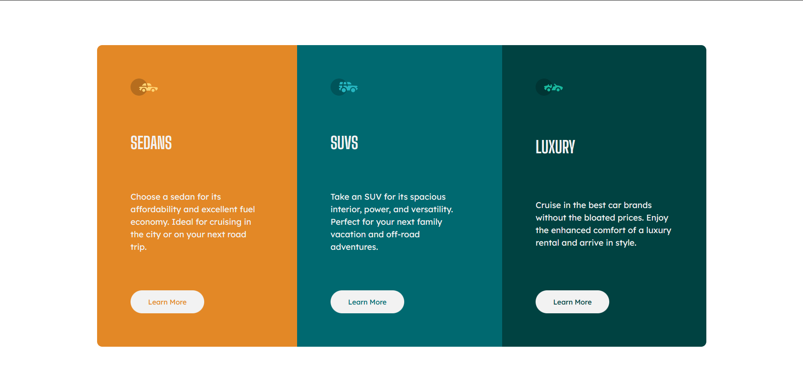

# Frontend Mentor - 3-column preview card component solution

This is a solution to the [3-column preview card component challenge on Frontend Mentor](https://www.frontendmentor.io/challenges/3column-preview-card-component-pH92eAR2-). Frontend Mentor challenges help you improve your coding skills by building realistic projects. 

## Table of contents

1. [Frontend Mentor - 3-column preview card component solution](#frontend-mentor---3-column-preview-card-component-solution)
	1. [Table of contents](#table-of-contents)
		1. [The challenge](#the-challenge)
		2. [Screenshot](#screenshot)
		3. [Links](#links)
		4. [Built with](#built-with)
		5. [What I learned](#what-i-learned)
	2. [Author](#author)

### The challenge

Users should be able to:

- View the optimal layout depending on their device's screen size
- See hover states for interactive elements

### Screenshot

### Links

- Solution URL: [Add solution URL here](https://your-solution-url.com)
- Live Site URL: [Add live site URL here](https://your-live-site-url.com)

### Built with

- Semantic HTML5 markup
- CSS custom properties
- Flexbox
- Mobile-first workflow
- [React](https://reactjs.org/) - JS library
- [Styled Components](https://styled-components.com/) - For styles

### What I learned

this is my first time creating a component using styled components, kinda good but i will try to combine it with tailwind to make it more good

## Author

- Website - [creeve.me](https://creeve.me)
- Frontend Mentor - [@zynth17](https://www.frontendmentor.io/profile/zynth17)
- Twitter - [@hi_reeve](https://twitter.com/hi_reeve)
- Instagram - [@hi_reeve](https://www.instagram.com/hi_reeve/)
- Github - [zynth17](https://github.com/zynth17)